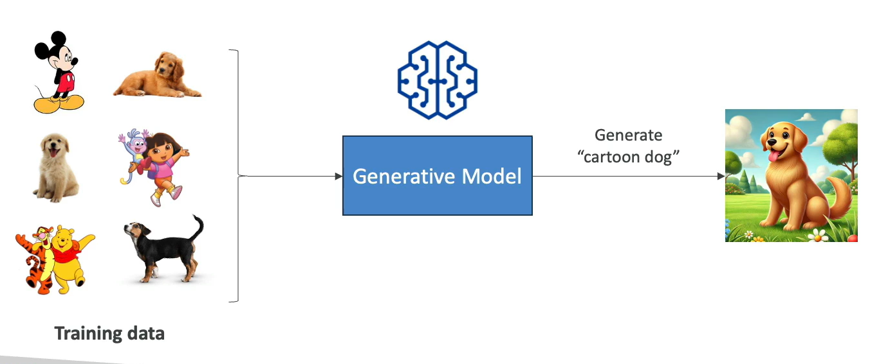
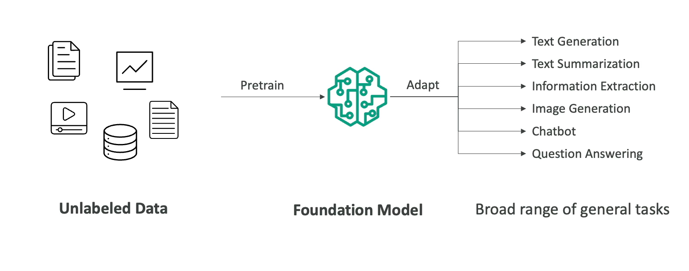
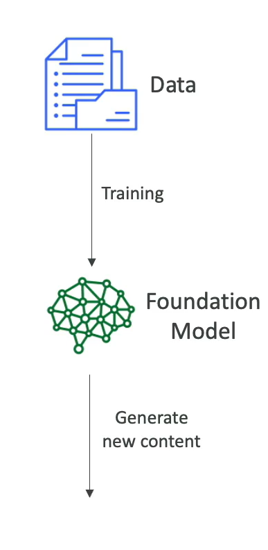
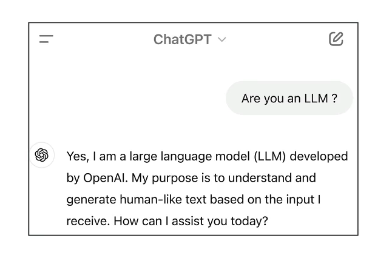
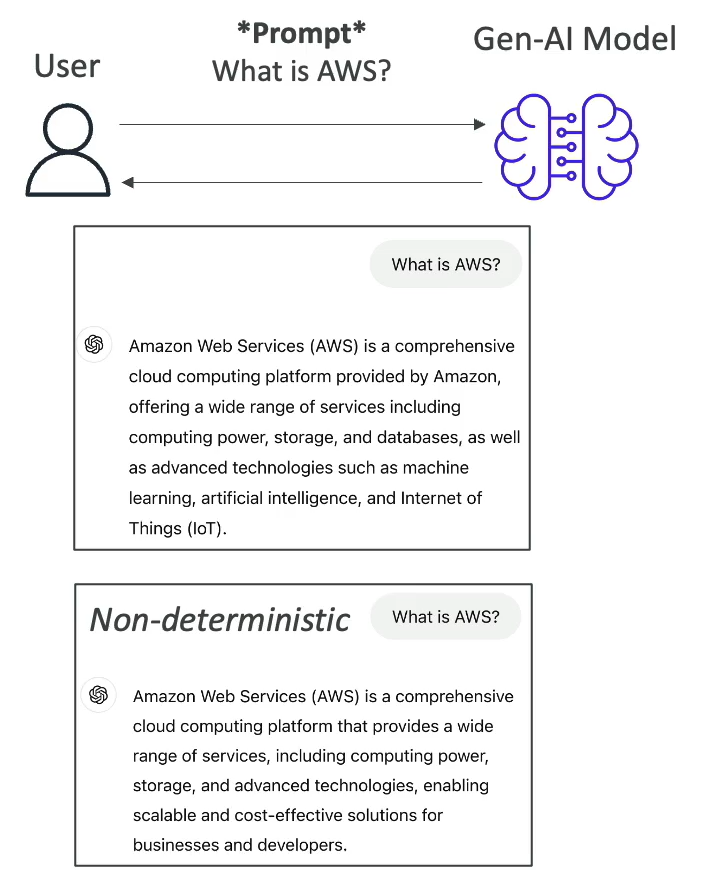
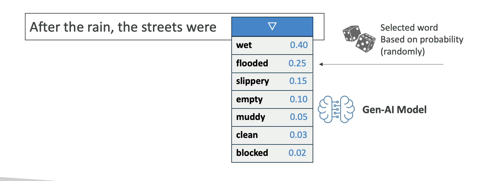
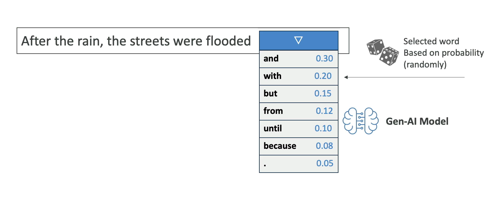
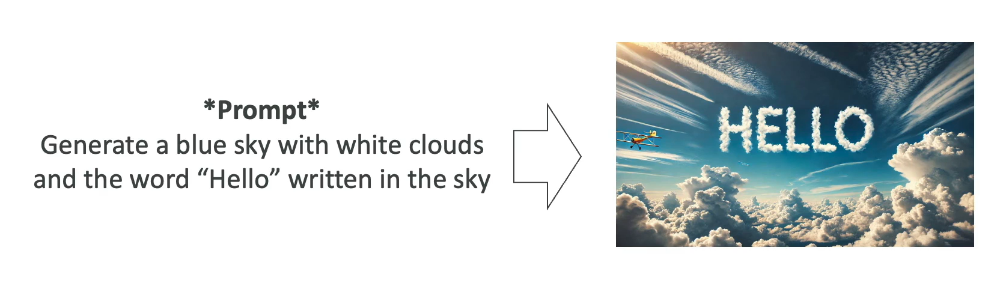
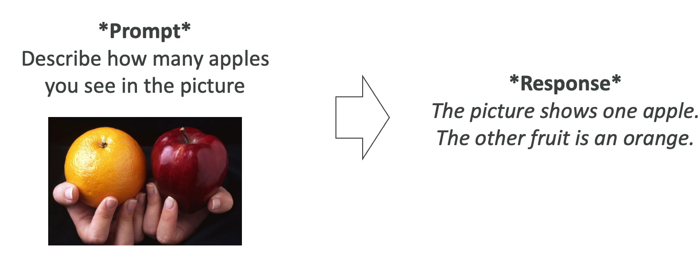
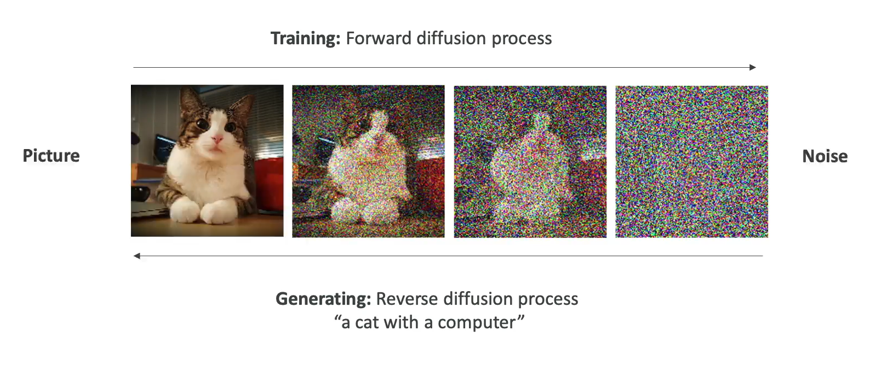

# What is Generative AI (GenAI)?

**Generative AI (Gen-AI)** is a subset of Deep Learning  

 Used to **generate new data** that is similar to the data it was trained on:

- Text

- Image

- Audio

- Code
  
- Video

 

## Foundation Model

- To generate data, we must rely on a Foundation Model

- Foundation Models are trained on a wide variety of input data

- The models may cost tens of millions of dollars to train

- Example: GPT-4o is the foundation model behind ChatGPT

- There is a wide selection of Foundation Models from companies:

  - OpenAI

  - Meta (Facebook)

  - Amazon

  - Google

  - Anthropic

- Some foundation models are open-source (free: Meta, Google BERT) and others under a commercial license (OpenAI, Anthropic, etc...)

## Large Language Models (LLM)

- Type of AI designed to generate coherent human-like text

- One notable example: GPT-4 (ChatGPT / OpenAI)

- Trained on large corpus of text data

- Usually very big models

  - Billions of parameters

  - Trained on books, articles, websites, other textual data

- Can perform language-related tasks:

  - Translation, Summarization

  - Question answering
  
  - Content creation

# Generative Language Models

- We usually interact with the LLM by giving a prompt

- Then, the model will leverage all the existing content it has learned from to generate new content

- **Non-deterministic**: the generated text may be different for every user that uses the same prompt

- The LLM generates a list of potential words alongside probabilities
- An algorithm selects a word from that list

 

## Generative AI for Images

- Generate images from text prompts

- Generate images from images

- Generate text from images

- Diffusion Models (ex: Stable Diffusion)

