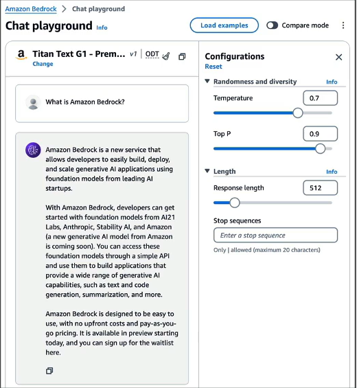
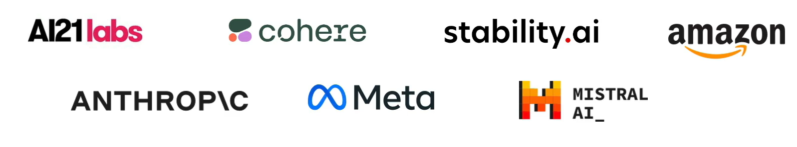
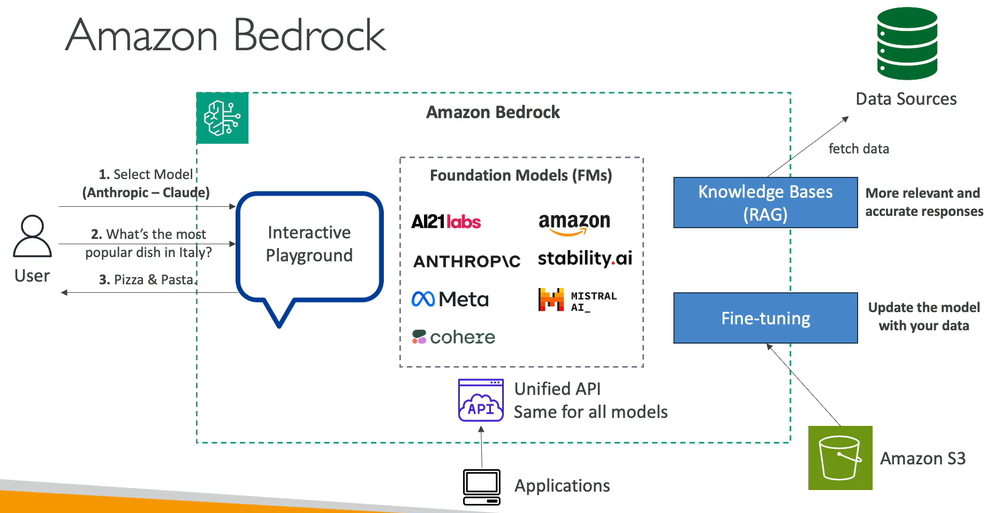

# Amazon Bedrock - Overview

## Amazon Bedrock

- Build Generative AI (Gen-AI) applications on AWS
- Fully-managed service, no servers for you to manage
- Keep control of your data used to train the model
- Pay-per-use pricing model
- Unified APIs
- Leverage a wide array of foundation models
- Out-of-the-box features: RAG, LLM Agents...
- Security, Privacy, Governance and Responsible AI features

## Amazon Bedrock – Foundation Models

Access to a wide range of Foundation Models (FM)

Amazon Bedrock makes a copy of the FM, available only to you, which you can further fine-tune with your own data.

None of your data is used to train the FM.

