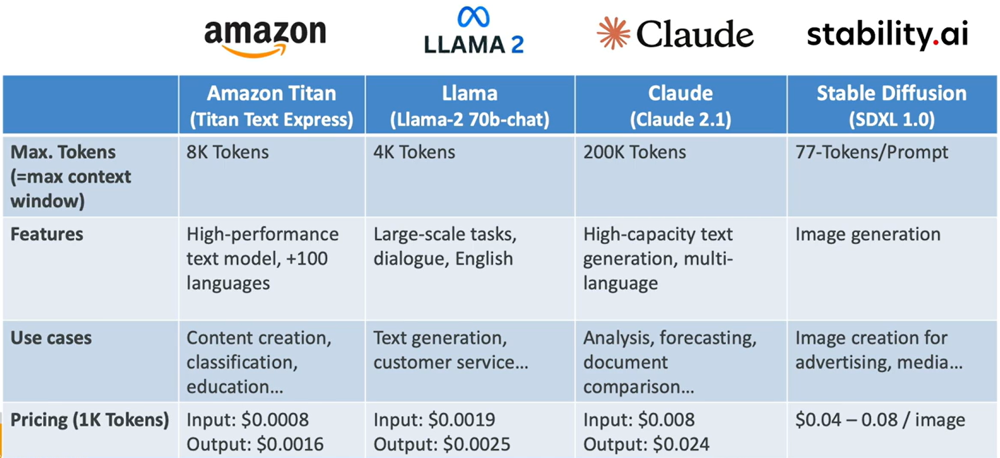

# Amazon Bedrock – Base Foundation Models

## How to Choose a Foundation Model?

Consider the following factors when selecting a model:

- Model type
- Performance requirements
- Capabilities
- Constraints
- Compliance requirements
- Level of customization
- Model size
- Inference options
- Licensing agreements
- Context window size
- Latency requirements
- Multimodal support (different input and output types)

## What is Amazon Titan?

Amazon Titan is a family of high-performing foundation models developed by AWS.

Key features include:

- Text, image, and multimodal model options
- Fully managed APIs
- Ability to customize models using your own data

## Cost Considerations

- Smaller models are typically more cost-effective.

## Amazon Titan vs Llama vs Claude vs Stable Diffusion

