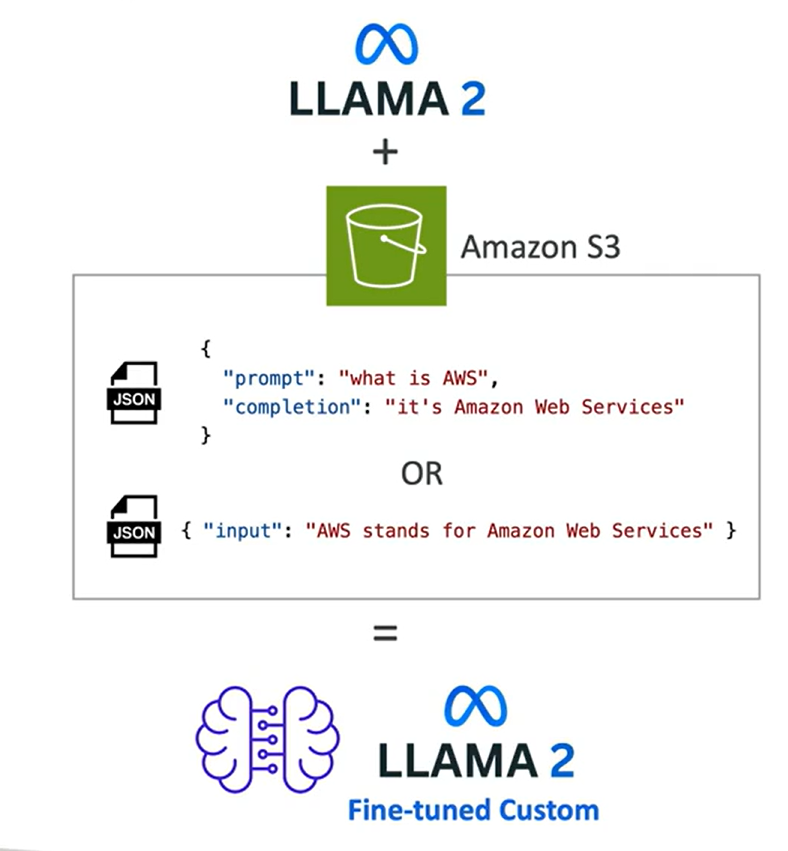
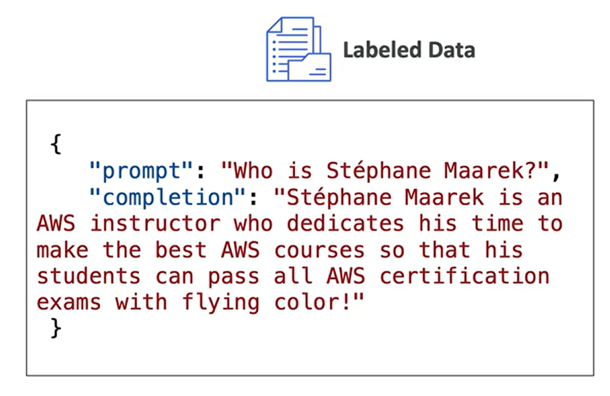
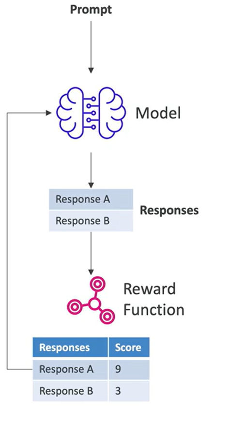
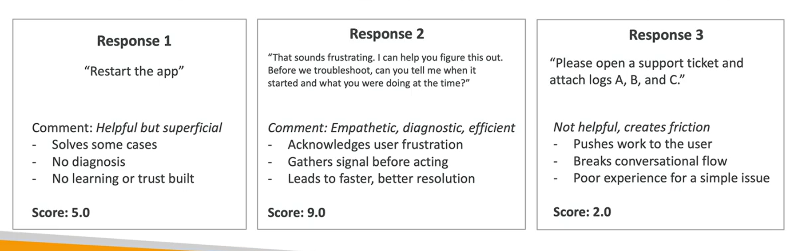
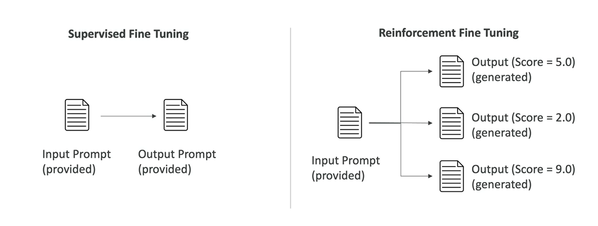
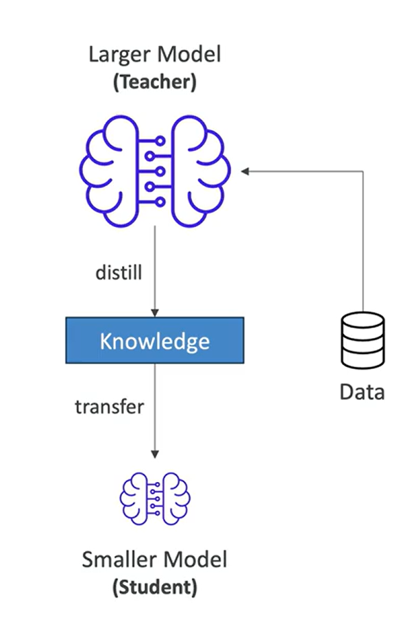

# Amazon Bedrock – Fine-Tuning a Model

- Adapt a copy of a foundation model with your own data.

- Fine-tuning changes the weights of the base foundation model.

- Training data must:

  - Adhere to a specific format.

  - Be stored in Amazon S3.

- Note: Not all models can be fine-tuned.

## Supervised Fine-Tuning

- Improves the performance of a model on specific tasks.

- Further trains a foundation model on a particular field or area of knowledge.

- Supervised Fine-Tuning uses **labeled examples** that consist of **input-output pairs**.

## Reinforcement Fine-Tuning

- Improves a foundation model (FM) using feedback-based learning.

- You provide the input data (training data or prompts).

- You define a **Reward Function** to evaluate model responses (outputs) and determine which responses are considered good.

  - For objective tasks, use **AWS Lambda** (Python code) to implement the reward function.

  - For subjective tasks, use another model as a judge by providing evaluation instructions.

- The model learns iteratively from reward function output scores and attempts to achieve higher scores over time.

## Reinforcement Fine-Tuning: Example

- **Example:** Technical customer support chatbot

- **Sample customer prompt:**  
  *"My app is running very slowly."*

- **Judge model instructions:**
  - Show empathy.
  - Run diagnostics with the user.

## Supervised Fine Tuning vs Reinforcement Fine Tuning

## Distillation

- Makes models smaller and faster.

- Can be up to **75% less expensive** than the original models.

- May result in a decrease in accuracy, but the trade-off can be acceptable depending on the use case.

- A larger (**teacher**) model transfers knowledge to a smaller (**student**) model.

- You provide input data (for example, prompts).

- Produces a lighter model with behavior similar to the original model.

- Focuses on **efficiency**, **speed**, and **cost reduction**.

## Fine-Tuning: Good to Know

- Re-training a foundation model (FM) requires a higher budget.

- **Supervised Fine-Tuning (SFT)** is usually cheaper because:
  - Computations are less intensive.
  - Less training data is typically required.

- Fine-tuning also requires experienced Machine Learning (ML) engineers.

- You must:
  - Prepare the data.
  - Perform the fine-tuning process.
  - Evaluate the model.

- Running a fine-tuned model is also more expensive.

  - **Option 1:** Run the custom model **on-demand** (priced per token).
  - **Option 2:** Purchase **Provisioned Throughput** (billed monthly).

## Fine-Tuning – Use Cases

- A chatbot designed with a particular persona or tone, or geared toward a specific purpose (for example, assisting customers or crafting advertisements).

- Training using more up-to-date information than what the language model previously had access to.

- Training with exclusive data (for example, historical emails, messages, or records from customer service interactions).

- Targeted use cases, such as:
  - Categorization
  - Accuracy assessment