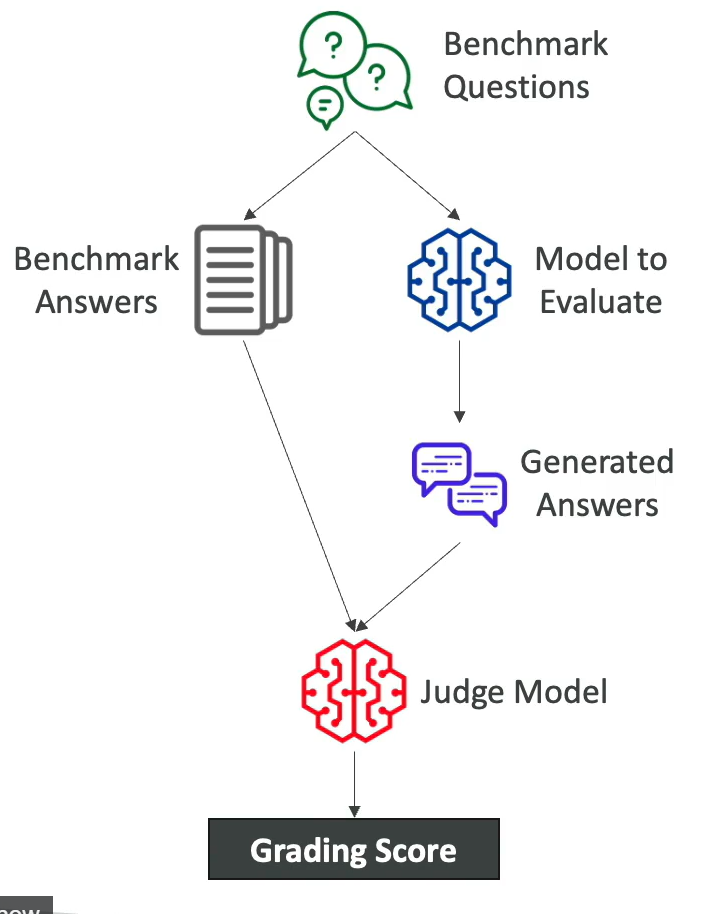
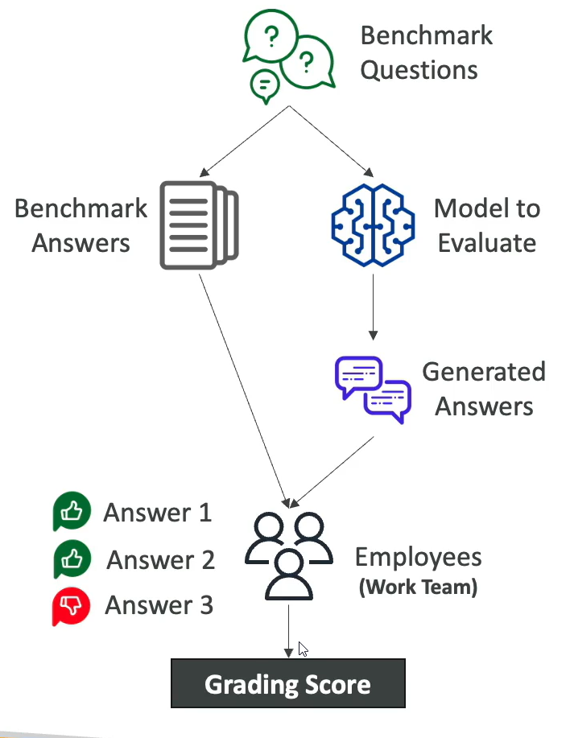
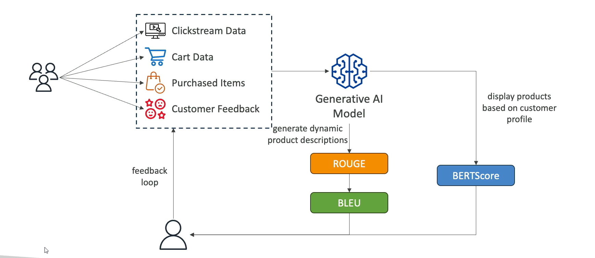

# Amazon Bedrock - Evaluation a Model

## Automatic Evaluation

- Evaluate a model for quality control.

- Built-in task types:

  - Text summarization

  - Question and answer

  - Text classification

  - Open-ended text generation

- Bring your own prompt dataset or use built-in curated prompt datasets.

- Scores are calculated automatically.

- Model scores are calculated using various statistical methods (for example, BERTScore, F1 score, and others).

## Note on Benchmark Datasets

Curated collections of data designed specifically for evaluating the performance of language models.

Wide range of topics, complexities, and linguistic phenomena.

Helpful for measuring:

- Accuracy
- Speed and efficiency
- Scalability

Some benchmark datasets allow you to quickly detect bias and potential discrimination against groups of people.

You can also create your own benchmark dataset that is specific to your business.

## Human Evaluation

Choose a work team to evaluate.

 - Employees of your company.

 - Subject-Matter Experts (SMEs).

Define metrics and evaluation criteria.

 - Thumbs up/down.

 - Ranking.

Choose from built-in task types (same as Automatic Evaluation) or create a custom task.

## Automated Metrics to Evaluate an FM

ROUGE: Recall-Oriented Understudy for Gisting Evaluation

 - Evaluating automatic summarization and machine translation systems

 - ROUGE-N – measure the number of matching n-grams between reference and generated text

 - ROUGE-L – longest common subsequence between reference and generated text

BLEU: Bilingual Evaluation Understudy

 - Evaluate the quality of generated text, especially for translations

 - Considers both precision and penalizes too much brevity

 - Looks at a combination of n-grams (1, 2, 3, 4)

BERTScore

 - Semantic similarity between generated text

 - Uses pre-trained BERT models (Bidirectional Encoder Representations from Transformers) to compare the contextualized embeddings of both texts and computes the cosine similarity between them.

 - Capable of capturing more nuance between the texts

Perplexity: how well the model predicts the next token (lower is better)

## Business Metrics to Evaluate a Model On

User Satisfaction – gather users’ feedbacks and assess their satisfaction with the model responses (e.g., user satisfaction for an ecommerce platform)

Average Revenue Per User (ARPU) – average revenue per user attributed to the Gen-AI app (e.g., monitor ecommerce user base revenue)

Cross-Domain Performance – measure the model’s ability to perform cross different domains tasks (e.g., monitor multi-domain ecommerce platform)

Conversion Rate – generate recommended desired outcomes such as purchases (e.g., optimizing ecommerce platform for higher conversion rate)

Efficiency – evaluate the model’s efficiency in computation, resource utilization... (e.g., improve production line efficiency)